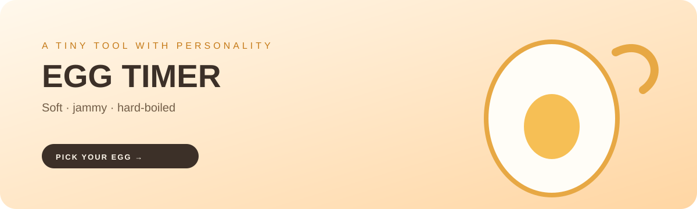

  

  <h1>🥚 WHIMSICAL EGG TIMER</h1>
  
<strong>Pick your perfect egg. Start a tiny timer. Collect a little joy.</strong>

  

    <a href="https://soheil-aghayani.github.io/egg-timer/"><strong>Open the live timer →</strong></a>
  

  

    
    
    
  

---

## What it is

Whimsical Egg Timer is a small browser experience for choosing and timing the egg you actually want: soft, jammy, or hard-boiled. It mixes a useful timer with playful copy, egg facts, tiny surprises, and a deliberately warm visual language.

## Highlights

- Three clear cooking outcomes with different timing paths
- Live countdown states and an end-of-timer sound
- Responsive card layout for phone and desktop screens
- Egg facts, characterful copy, and a hidden interaction for repeat visitors
- No framework, build step, account, or backend

## Run locally

~~~bash
git clone https://github.com/Soheil-Aghayani/egg-timer.git
cd egg-timer
~~~

Open index.html directly, or serve the folder:

~~~bash
python -m http.server 8080
~~~

Then visit http://localhost:8080.

  Small tool, strong personality.

